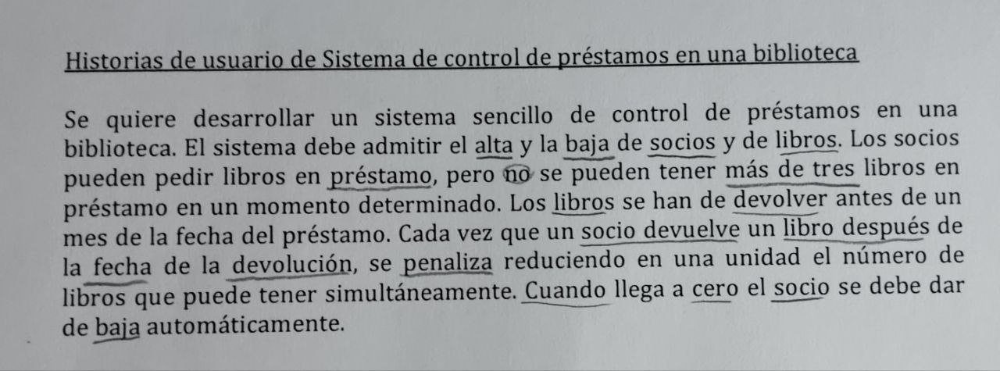

---

  

>
>

> **Autor:** Quintín Mesa Romero
> 
> **Titulación:** Doble Grado en Ingeniería Informática y Matemáticas
> 
> **Asignatura:** Metodologías de Desarrollo Ágil
> 
> **Correo**: quintinmr@correo.ugr.es
> 
> **Fecha:** 10/10/2024

---

En el presente documento se recoge una lista de historias de usuario, extraídas del enunciado en el que se especifica la funcionalidad del sistema. Además se han prorizado dichas historias de usuario, considerando proridades 1 (alta), 2 (media) y 3 (baja).
El formato que se ha seguido para las HU es el siguiente:

>   **Como X, quiero Y, para Z**

### **Prioridad 1**

* Como bibliotecario, quiero dar de alta a un socio, para gestionar la membresía de la biblioteca.
* Como bibliotecario, quiero dar de baja a un socio, para gestionar la membresía de la biblioteca.
* Como bibliotecario, quiero dar de alta a un libro, para mantener actualizado el listado de libros.
* Como bibliotecario, quiero dar de baja a un libro, para mantener actualizado el listado de libros.
* Como socio, quiero pedir libros en préstamo, para hacer uso de mi membresía en la biblioteca.
* Como sistema, quiero asegurar que ningún socio tenga más de tres libros prestados al mismo tiempo, para evitar acumulaciones.
* Como sistema, quiero asegurar que los libros se devuelve antes de un mes de la fecha del préstamo, para garantizar la disponibilidad de los mismos.
* Como sistema, quiero penalizar a los socios que devuelvan un libro fuera de plazo, para advertir de la puntualidad requerida en las devoluciones.

### **Prioridad 2**

* Como sistema, quiero reducir en una unidad el número de libros que puede tener  simultáneamente un socio que se retrasa en la devolución, para gestionar la consecuente penalización.
* Como sistema, quiero dar de baja automáticamente a los socios cuyo límite de libros en préstamo llegue a cero, para cumplir con la normativa de la biblioteca.
* Como socio, quiero ver el estado de mis préstamos y las fechas de devolución, para organizar las devoluciones.
* Como bibliotecari, quiero generar informes de socios en alta y baja, para evaluar las reglas de devolución.

### **Prioridad 3**

* Como sistema, quiero enviar notificaciones recordatorias a los socios antes de la fecha de entrega, para evitar penalizaciones.
* Como socio, quiero recibir notificaciones recordatorias antes de la fecha límite de devolución, para evitar penalizaciones.

